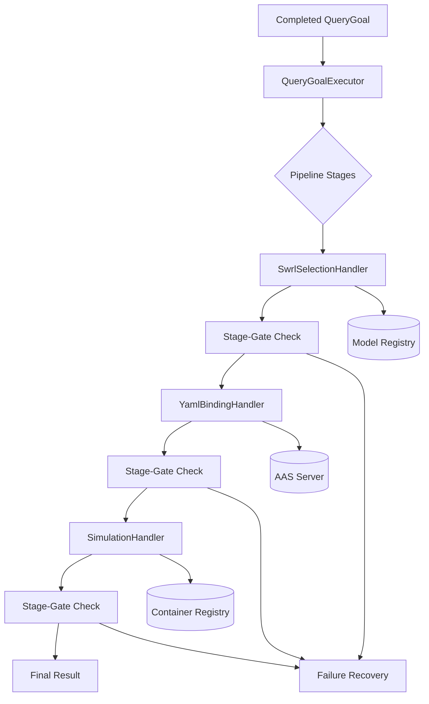

# QueryGoal Runtime Executor 구현 계획

## 📋 문서 정보
- **작성일**: 2025-09-29
- **참고 문서**: `/Users/jsh/Desktop/aas-project/gemini-ver/docs/QueryGoal_Runtime_Integration_Plan.md`
- **목적**: QueryGoal 파이프라인으로 생성된 Goal을 실제 AAS 서버와 시뮬레이션 엔진에 연동하는 Runtime Executor 구현

## 🎯 구현 목표

### 핵심 비전
완성된 QueryGoal 객체를 받아 `metadata.pipelineStages` 순서대로 실제 실행하여 스마트 팩토리 작업을 수행하는 Production Runtime System 구축

### 주요 목표
1. **QueryGoalExecutor 구현**: Stage-Gate 방식의 실행 오케스트레이터
2. **Goal3 특화 스테이지**: swrlSelection → yamlBinding → simulation
3. **공통 런타임 컴포넌트**: AAS Client, Manifest Parser, 작업 디렉터리 관리
4. **확장 가능한 아키텍처**: 다른 Goal 유형에도 재사용 가능한 구조

## 📊 현재 상황 분석

### ✅ 기존 구현 완료 상태
```
Current QueryGoal Pipeline (완료):
├── Pattern Matching → Goal 유형 식별 ✅
├── Template Loading → 기본 구조 생성 ✅
├── Parameter Filling → 파라미터 바인딩 ✅
├── Action Plan Resolution → 실행 계획 수립 ✅
├── Model Selection → AI/ML 모델 선택 ✅
└── Validation → 품질 검증 ✅

Result: QueryGoal JSON 객체 생성 완료
```

### 🔄 Runtime Executor 구현 대상
```
New Runtime Execution (구현 필요):
├── QueryGoalExecutor 오케스트레이터 🔄
├── Stage 핸들러 시스템 🔄
├── AAS 서버 연동 클라이언트 🔄
├── 시뮬레이션 엔진 통합 🔄
└── Stage-Gate 성공 판정 🔄

Result: 실제 스마트 팩토리 작업 수행
```

## 🏗️ Runtime Executor 아키텍처

### 전체 실행 플로우


### 핵심 컴포넌트 구조
```
querygoal/
├── runtime/
│   ├── executor.py              # QueryGoalExecutor 메인 오케스트레이터
│   ├── handlers/
│   │   ├── base_handler.py      # 기본 핸들러 클래스
│   │   ├── swrl_selection_handler.py
│   │   ├── yaml_binding_handler.py
│   │   └── simulation_handler.py
│   ├── clients/
│   │   ├── aas_client.py        # AAS 서버 REST API 클라이언트
│   │   └── container_client.py   # Docker/K8s 컨테이너 클라이언트
│   ├── utils/
│   │   ├── manifest_parser.py   # YAML 메니페스트 파서
│   │   ├── work_directory.py    # 실행별 작업 디렉터리 관리
│   │   └── stage_gate.py        # Stage-Gate 성공 판정 로직
│   └── exceptions.py            # Runtime 예외 클래스들
```

## 📋 Phase 1: 핵심 Runtime Executor (주 1-2)

### Task 1.1: QueryGoalExecutor 오케스트레이터 구현 (2일)

#### 메인 실행기: `querygoal/runtime/executor.py`
```python
"""
QueryGoal Runtime Executor
완성된 QueryGoal을 실제 실행하는 오케스트레이터
"""
import asyncio
import logging
from typing import Dict, Any, List, Optional
from datetime import datetime
from dataclasses import dataclass
from pathlib import Path

from ..pipeline.orchestrator import PipelineOrchestrator
from .handlers.base_handler import BaseHandler
from .handlers.swrl_selection_handler import SwrlSelectionHandler
from .handlers.yaml_binding_handler import YamlBindingHandler
from .handlers.simulation_handler import SimulationHandler
from .utils.work_directory import WorkDirectoryManager
from .utils.stage_gate import StageGateValidator
from .exceptions import (
    RuntimeExecutionError,
    StageExecutionError,
    StageGateFailureError
)

logger = logging.getLogger("querygoal.runtime")

@dataclass
class ExecutionContext:
    """실행 컨텍스트 정보"""
    goal_id: str
    goal_type: str
    work_directory: Path
    start_time: datetime
    pipeline_stages: List[str]
    current_stage: Optional[str] = None
    stage_results: Dict[str, Any] = None

    def __post_init__(self):
        if self.stage_results is None:
            self.stage_results = {}

class QueryGoalExecutor:
    """
    QueryGoal Runtime Executor
    완성된 QueryGoal을 받아 실제 실행을 수행
    """

    def __init__(self):
        self.work_dir_manager = WorkDirectoryManager()
        self.stage_gate_validator = StageGateValidator()

        # Stage 핸들러 매핑
        self.stage_handlers = {
            "swrlSelection": SwrlSelectionHandler(),
            "yamlBinding": YamlBindingHandler(),
            "simulation": SimulationHandler()
        }

        # Stage-Gate 성공 기준
        self.stage_criteria = {
            "swrlSelection": {
                "success_criteria": lambda result: result.get("selectedModel") is not None
            },
            "yamlBinding": {
                "success_criteria": lambda result: result.get("success_rate", 0) >= 1.0
            },
            "simulation": {
                "success_criteria": lambda result: result.get("status") == "completed"
            }
        }

    async def execute_querygoal(self, querygoal: Dict[str, Any]) -> Dict[str, Any]:
        """
        QueryGoal 실행 메인 엔트리포인트
        """
        start_time = datetime.utcnow()
        qg = querygoal["QueryGoal"]

        try:
            # 실행 컨텍스트 초기화
            context = ExecutionContext(
                goal_id=qg["goalId"],
                goal_type=qg["goalType"],
                work_directory=self.work_dir_manager.create_work_directory(qg["goalId"]),
                start_time=start_time,
                pipeline_stages=qg["metadata"]["pipelineStages"]
            )

            logger.info(f"🚀 Starting QueryGoal execution for {context.goal_id}")
            logger.info(f"📋 Pipeline stages: {context.pipeline_stages}")

            # Stage별 순차 실행
            execution_log = {
                "goalId": context.goal_id,
                "startTime": start_time.isoformat(),
                "stages": [],
                "status": "in_progress"
            }

            for stage_name in context.pipeline_stages:
                context.current_stage = stage_name

                try:
                    # Stage 실행
                    stage_result = await self._execute_stage(
                        stage_name, querygoal, context
                    )

                    # Stage-Gate 검증
                    gate_result = self.stage_gate_validator.validate_stage(
                        stage_name, stage_result, self.stage_criteria
                    )

                    if not gate_result.passed:
                        raise StageGateFailureError(
                            f"Stage-Gate failed for {stage_name}: {gate_result.reason}"
                        )

                    # 성공 시 결과 기록
                    context.stage_results[stage_name] = stage_result

                    execution_log["stages"].append({
                        "stage": stage_name,
                        "status": "completed",
                        "result": stage_result,
                        "gate_check": gate_result.__dict__,
                        "timestamp": datetime.utcnow().isoformat()
                    })

                    logger.info(f"✅ Stage '{stage_name}' completed successfully")

                except Exception as e:
                    # Stage 실패 처리
                    error_info = {
                        "stage": stage_name,
                        "status": "failed",
                        "error": str(e),
                        "timestamp": datetime.utcnow().isoformat()
                    }

                    execution_log["stages"].append(error_info)
                    execution_log["status"] = "failed"
                    execution_log["failedStage"] = stage_name
                    execution_log["endTime"] = datetime.utcnow().isoformat()

                    logger.error(f"❌ Stage '{stage_name}' failed: {e}")

                    raise RuntimeExecutionError(
                        f"QueryGoal execution failed at stage '{stage_name}': {e}"
                    ) from e

            # 전체 실행 성공
            execution_log["status"] = "completed"
            execution_log["endTime"] = datetime.utcnow().isoformat()

            # 최종 결과 구성
            final_result = {
                "QueryGoal": qg,
                "executionLog": execution_log,
                "results": context.stage_results,
                "workDirectory": str(context.work_directory)
            }

            logger.info(f"🎉 QueryGoal {context.goal_id} executed successfully")
            return final_result

        except Exception as e:
            logger.error(f"💥 QueryGoal execution failed: {e}")

            # 실패 시 정리 작업
            if 'context' in locals():
                await self._cleanup_on_failure(context, str(e))

            raise RuntimeExecutionError(f"QueryGoal execution failed: {e}") from e

        finally:
            # 리소스 정리 (성공/실패 무관)
            if 'context' in locals():
                await self._cleanup_resources(context)

    async def _execute_stage(self,
                           stage_name: str,
                           querygoal: Dict[str, Any],
                           context: ExecutionContext) -> Dict[str, Any]:
        """개별 Stage 실행"""

        if stage_name not in self.stage_handlers:
            raise StageExecutionError(f"Unknown stage: {stage_name}")

        handler = self.stage_handlers[stage_name]

        logger.info(f"📍 Executing stage: {stage_name}")
        stage_start_time = datetime.utcnow()

        try:
            # Stage 실행
            result = await handler.execute(querygoal, context)

            execution_time = (datetime.utcnow() - stage_start_time).total_seconds()

            # 실행 메타데이터 추가
            result.update({
                "stage": stage_name,
                "executionTime": execution_time,
                "timestamp": datetime.utcnow().isoformat()
            })

            return result

        except Exception as e:
            execution_time = (datetime.utcnow() - stage_start_time).total_seconds()

            logger.error(f"Stage {stage_name} execution failed after {execution_time:.2f}s: {e}")

            raise StageExecutionError(
                f"Stage '{stage_name}' execution failed: {e}"
            ) from e

    async def _cleanup_on_failure(self, context: ExecutionContext, error_message: str):
        """실행 실패 시 정리 작업"""
        try:
            # 실패 로그 저장
            failure_log_path = context.work_directory / "failure.log"
            with open(failure_log_path, 'w') as f:
                f.write(f"Execution failed at: {datetime.utcnow().isoformat()}\n")
                f.write(f"Failed stage: {context.current_stage}\n")
                f.write(f"Error: {error_message}\n")
                f.write(f"Stage results: {context.stage_results}\n")

            logger.info(f"💾 Failure log saved to {failure_log_path}")

        except Exception as cleanup_error:
            logger.error(f"Failed to save failure log: {cleanup_error}")

    async def _cleanup_resources(self, context: ExecutionContext):
        """리소스 정리"""
        try:
            # 필요시 작업 디렉터리 정리 (설정에 따라)
            # self.work_dir_manager.cleanup_work_directory(context.work_directory)

            logger.debug(f"🧹 Resources cleaned up for {context.goal_id}")

        except Exception as cleanup_error:
            logger.warning(f"Resource cleanup warning: {cleanup_error}")

# Factory pattern for executor creation
def create_querygoal_executor() -> QueryGoalExecutor:
    """QueryGoalExecutor 팩토리 함수"""
    return QueryGoalExecutor()
```

#### Stage-Gate 검증 시스템: `querygoal/runtime/utils/stage_gate.py`
```python
"""
Stage-Gate Validation System
각 단계의 성공/실패를 판정하는 검증 로직
"""
import logging
from typing import Dict, Any, Callable
from dataclasses import dataclass

logger = logging.getLogger("querygoal.stage_gate")

@dataclass
class StageGateResult:
    """Stage-Gate 검증 결과"""
    stage_name: str
    passed: bool
    reason: str
    validation_details: Dict[str, Any]

class StageGateValidator:
    """Stage-Gate 검증기"""

    def validate_stage(self,
                      stage_name: str,
                      stage_result: Dict[str, Any],
                      stage_criteria: Dict[str, Dict]) -> StageGateResult:
        """
        Stage 결과를 기준에 따라 검증
        """

        if stage_name not in stage_criteria:
            logger.warning(f"No criteria defined for stage: {stage_name}")
            return StageGateResult(
                stage_name=stage_name,
                passed=True,  # 기준이 없으면 통과로 처리
                reason="No validation criteria defined",
                validation_details={}
            )

        criteria = stage_criteria[stage_name]
        success_criteria = criteria["success_criteria"]

        try:
            # 성공 조건 검증
            if callable(success_criteria):
                passed = success_criteria(stage_result)
            else:
                # 간단한 키-값 검증
                passed = stage_result.get(success_criteria, False)

            validation_details = {
                "stage_result_keys": list(stage_result.keys()),
                "validation_applied": str(success_criteria),
                "result_sample": {k: str(v)[:100] for k, v in list(stage_result.items())[:3]}
            }

            if passed:
                return StageGateResult(
                    stage_name=stage_name,
                    passed=True,
                    reason="Stage criteria satisfied",
                    validation_details=validation_details
                )
            else:
                return StageGateResult(
                    stage_name=stage_name,
                    passed=False,
                    reason=f"Stage criteria not met: {success_criteria}",
                    validation_details=validation_details
                )

        except Exception as e:
            logger.error(f"Stage-Gate validation error for {stage_name}: {e}")
            return StageGateResult(
                stage_name=stage_name,
                passed=False,
                reason=f"Validation error: {e}",
                validation_details={"error": str(e)}
            )
```

### Task 1.2: Base Handler 및 예외 시스템 (1일)

#### 기본 핸들러: `querygoal/runtime/handlers/base_handler.py`
```python
"""
Base Handler for Runtime Stages
모든 Stage 핸들러의 기본 클래스
"""
import logging
from abc import ABC, abstractmethod
from typing import Dict, Any
from datetime import datetime

from ..executor import ExecutionContext

logger = logging.getLogger("querygoal.handlers")

class BaseHandler(ABC):
    """Stage 핸들러 기본 클래스"""

    def __init__(self):
        self.handler_name = self.__class__.__name__
        self.logger = logging.getLogger(f"querygoal.handlers.{self.handler_name}")

    @abstractmethod
    async def execute(self,
                     querygoal: Dict[str, Any],
                     context: ExecutionContext) -> Dict[str, Any]:
        """
        Stage 실행 로직 (하위 클래스에서 구현)

        Args:
            querygoal: 완성된 QueryGoal 객체
            context: 실행 컨텍스트

        Returns:
            Stage 실행 결과 딕셔너리
        """
        pass

    async def pre_execute(self,
                         querygoal: Dict[str, Any],
                         context: ExecutionContext):
        """실행 전 공통 준비 작업"""
        self.logger.info(f"🔄 Starting {self.handler_name} for {context.goal_id}")

    async def post_execute(self,
                          result: Dict[str, Any],
                          context: ExecutionContext):
        """실행 후 공통 정리 작업"""
        self.logger.info(f"✅ Completed {self.handler_name} for {context.goal_id}")

    def validate_prerequisites(self,
                              querygoal: Dict[str, Any],
                              context: ExecutionContext) -> bool:
        """실행 전 전제조건 검증"""
        # 기본적인 QueryGoal 구조 검증
        qg = querygoal.get("QueryGoal", {})

        required_fields = ["goalId", "goalType", "metadata"]
        for field in required_fields:
            if field not in qg:
                self.logger.error(f"Missing required field in QueryGoal: {field}")
                return False

        return True

    def create_error_result(self, error_message: str, details: Dict[str, Any] = None) -> Dict[str, Any]:
        """오류 결과 생성"""
        return {
            "status": "error",
            "error": error_message,
            "details": details or {},
            "handler": self.handler_name,
            "timestamp": datetime.utcnow().isoformat()
        }

    def create_success_result(self, data: Dict[str, Any]) -> Dict[str, Any]:
        """성공 결과 생성"""
        return {
            "status": "success",
            "handler": self.handler_name,
            "timestamp": datetime.utcnow().isoformat(),
            **data
        }
```

#### 예외 클래스: `querygoal/runtime/exceptions.py`
```python
"""
Runtime Execution Exceptions
Runtime 실행 중 발생하는 예외들
"""

class RuntimeExecutionError(Exception):
    """Runtime 실행 실패"""
    pass

class StageExecutionError(RuntimeExecutionError):
    """Stage 실행 실패"""
    pass

class StageGateFailureError(RuntimeExecutionError):
    """Stage-Gate 검증 실패"""
    pass

class AASConnectionError(RuntimeExecutionError):
    """AAS 서버 연결 실패"""
    pass

class SimulationExecutionError(RuntimeExecutionError):
    """시뮬레이션 실행 실패"""
    pass

class ManifestParsingError(RuntimeExecutionError):
    """메니페스트 파싱 실패"""
    pass

class WorkDirectoryError(RuntimeExecutionError):
    """작업 디렉터리 오류"""
    pass
```

## 📋 Phase 2: Goal3 특화 Stage 핸들러 (주 3-4)

### Task 2.1: SWRL Selection Handler (2일)

#### SWRL 선택 핸들러: `querygoal/runtime/handlers/swrl_selection_handler.py`
```python
"""
SWRL Selection Handler
Goal3의 swrlSelection 단계를 처리
"""
import asyncio
from typing import Dict, Any
from pathlib import Path

from .base_handler import BaseHandler
from ..executor import ExecutionContext
from ..exceptions import StageExecutionError
from ...pipeline.model_selector import ModelSelector

class SwrlSelectionHandler(BaseHandler):
    """SWRL 기반 모델 선택 핸들러"""

    def __init__(self):
        super().__init__()
        self.model_selector = ModelSelector()

    async def execute(self,
                     querygoal: Dict[str, Any],
                     context: ExecutionContext) -> Dict[str, Any]:
        """SWRL Selection 실행"""

        await self.pre_execute(querygoal, context)

        if not self.validate_prerequisites(querygoal, context):
            return self.create_error_result("Prerequisites validation failed")

        try:
            qg = querygoal["QueryGoal"]
            goal_type = qg["goalType"]

            # 이미 선택된 모델이 있는지 확인
            selected_model = qg.get("selectedModel")
            if selected_model:
                self.logger.info(f"📦 Model already selected: {selected_model.get('modelId')}")

                # 메니페스트 경로 확인
                manifest_path = await self._load_model_manifest(selected_model, context)

                result_data = {
                    "selectedModel": selected_model,
                    "manifestPath": str(manifest_path),
                    "selectionMethod": "pre_selected",
                    "modelStatus": "ready"
                }

                await self.post_execute(result_data, context)
                return self.create_success_result(result_data)

            else:
                # 새로운 모델 선택 수행
                self.logger.info(f"🔍 Performing model selection for {goal_type}")

                # ModelSelector를 통한 모델 선택
                updated_qg = self.model_selector.bind_model_to_querygoal(
                    querygoal, goal_type
                )

                selected_model = updated_qg["QueryGoal"].get("selectedModel")
                if not selected_model:
                    return self.create_error_result(
                        f"No suitable model found for {goal_type}"
                    )

                # 선택된 모델의 메니페스트 로드
                manifest_path = await self._load_model_manifest(selected_model, context)

                result_data = {
                    "selectedModel": selected_model,
                    "manifestPath": str(manifest_path),
                    "selectionMethod": "swrl_selection",
                    "modelStatus": "ready"
                }

                # QueryGoal 업데이트
                querygoal["QueryGoal"]["selectedModel"] = selected_model

                await self.post_execute(result_data, context)
                return self.create_success_result(result_data)

        except Exception as e:
            self.logger.error(f"SWRL Selection failed: {e}")
            return self.create_error_result(
                f"SWRL Selection failed: {e}",
                {"goal_type": goal_type}
            )

    async def _load_model_manifest(self,
                                  selected_model: Dict[str, Any],
                                  context: ExecutionContext) -> Path:
        """모델 메니페스트 파일 로드"""

        try:
            # 최상위 레벨에서 metaDataFile 확인 (metadata 중첩 없음)
            metadata_file = selected_model.get("metaDataFile")

            # MetaData 키 변형도 확인 (SWRL 엔진에서 반환될 수 있음)
            if not metadata_file:
                metadata_file = selected_model.get("MetaData")

            if not metadata_file:
                raise StageExecutionError("Model metadata file not specified")

            # 메니페스트 파일 경로 결정
            if metadata_file.startswith("/"):
                # 절대 경로
                manifest_path = Path(metadata_file)
            else:
                # 상대 경로 - config 디렉터리에서 찾기
                from pathlib import Path
                config_dir = Path(__file__).parent.parent.parent.parent / "config"
                manifest_path = config_dir / metadata_file

            # 파일 존재 확인
            if not manifest_path.exists():
                raise StageExecutionError(f"Manifest file not found: {manifest_path}")

            self.logger.info(f"📋 Loaded manifest: {manifest_path}")
            return manifest_path

        except Exception as e:
            raise StageExecutionError(f"Failed to load model manifest: {e}") from e

    def validate_prerequisites(self,
                              querygoal: Dict[str, Any],
                              context: ExecutionContext) -> bool:
        """SWRL Selection 전제조건 검증"""

        if not super().validate_prerequisites(querygoal, context):
            return False

        qg = querygoal["QueryGoal"]

        # Goal3에만 적용 가능한지 확인
        if not qg.get("goalType", "").startswith("goal3"):
            self.logger.error("SWRL Selection is only applicable to Goal3")
            return False

        return True
```

### Task 2.2: YAML Binding Handler (3일)

#### YAML 바인딩 핸들러: `querygoal/runtime/handlers/yaml_binding_handler.py`
```python
"""
YAML Binding Handler
Goal3의 yamlBinding 단계를 처리 - AAS 서버에서 데이터 수집 및 JSON 파일 생성
"""
import asyncio
import json
from typing import Dict, Any, List
from pathlib import Path

from .base_handler import BaseHandler
from ..executor import ExecutionContext
from ..clients.aas_client import AASClient
from ..utils.manifest_parser import ManifestParser
from ..exceptions import StageExecutionError, AASConnectionError

class YamlBindingHandler(BaseHandler):
    """YAML 메니페스트 기반 데이터 바인딩 핸들러"""

    def __init__(self):
        super().__init__()
        self.aas_client = AASClient()
        self.manifest_parser = ManifestParser()

    async def execute(self,
                     querygoal: Dict[str, Any],
                     context: ExecutionContext) -> Dict[str, Any]:
        """YAML Binding 실행"""

        await self.pre_execute(querygoal, context)

        if not self.validate_prerequisites(querygoal, context):
            return self.create_error_result("Prerequisites validation failed")

        try:
            qg = querygoal["QueryGoal"]

            # 이전 단계에서 생성된 메니페스트 경로 확인
            manifest_path = context.stage_results.get("swrlSelection", {}).get("manifestPath")
            if not manifest_path:
                return self.create_error_result("Manifest path not found from previous stage")

            # 메니페스트 파싱
            self.logger.info(f"📋 Parsing manifest: {manifest_path}")
            manifest_data = await self.manifest_parser.parse_manifest(Path(manifest_path))

            # 데이터 소스 목록 추출
            data_sources = manifest_data.get("data_sources", [])
            if not data_sources:
                return self.create_error_result("No data sources found in manifest")

            # 작업 디렉터리에 JSON 파일 생성
            json_files = {}
            success_count = 0

            for source in data_sources:
                try:
                    source_name = source["name"]
                    source_type = source["type"]

                    self.logger.info(f"🔍 Processing data source: {source_name}")

                    if source_type == "aas_property":
                        # AAS Property에서 데이터 수집
                        json_data = await self._fetch_aas_property_data(source)

                    elif source_type == "aas_shell_collection":
                        # AAS Shell 컬렉션에서 데이터 수집 (machines.json)
                        json_data = await self._fetch_aas_shell_collection(source)

                    else:
                        raise StageExecutionError(f"Unknown data source type: {source_type}")

                    # JSON 파일 저장
                    json_file_path = context.work_directory / f"{source_name}.json"
                    with open(json_file_path, 'w', encoding='utf-8') as f:
                        json.dump(json_data, f, indent=2, ensure_ascii=False)

                    json_files[source_name] = {
                        "path": str(json_file_path),
                        "size": json_file_path.stat().st_size,
                        "record_count": len(json_data) if isinstance(json_data, list) else 1
                    }

                    success_count += 1
                    self.logger.info(f"✅ Created {source_name}.json ({json_files[source_name]['record_count']} records)")

                except Exception as e:
                    self.logger.error(f"❌ Failed to process {source.get('name', 'unknown')}: {e}")
                    json_files[source.get('name', 'unknown')] = {
                        "error": str(e)
                    }

            # 성공률 계산
            total_sources = len(data_sources)
            success_rate = success_count / total_sources if total_sources > 0 else 0

            result_data = {
                "manifestPath": manifest_path,
                "totalDataSources": total_sources,
                "successfulSources": success_count,
                "success_rate": success_rate,
                "jsonFiles": json_files,
                "workDirectory": str(context.work_directory)
            }

            await self.post_execute(result_data, context)
            return self.create_success_result(result_data)

        except Exception as e:
            self.logger.error(f"YAML Binding failed: {e}")
            return self.create_error_result(
                f"YAML Binding failed: {e}",
                {"work_directory": str(context.work_directory)}
            )

    async def _fetch_aas_property_data(self, source: Dict[str, Any]) -> List[Dict[str, Any]]:
        """AAS Property에서 데이터 수집"""

        submodel_id = source["config"]["submodel_id"]
        property_path = source["config"]["property_path"]

        try:
            # AAS 클라이언트를 통해 데이터 조회
            property_data = await self.aas_client.get_submodel_property(
                submodel_id, property_path
            )

            # JSON 형태로 변환
            if isinstance(property_data, str):
                # JSON 문자열인 경우 파싱
                return json.loads(property_data)
            elif isinstance(property_data, (list, dict)):
                return property_data
            else:
                # 단순 값인 경우 배열로 래핑
                return [{"value": property_data}]

        except Exception as e:
            raise AASConnectionError(f"Failed to fetch AAS property {property_path}: {e}") from e

    async def _fetch_aas_shell_collection(self, source: Dict[str, Any]) -> List[Dict[str, Any]]:
        """AAS Shell 컬렉션에서 데이터 수집 (machines.json 생성용)"""

        shell_filter = source["config"].get("shell_filter", {})
        combination_rules = source["config"].get("combination_rules", [])

        try:
            # AAS 서버에서 모든 Shell 목록 조회
            shells = await self.aas_client.list_shells()

            # 필터 적용
            filtered_shells = []
            for shell in shells:
                if self._matches_shell_filter(shell, shell_filter):
                    filtered_shells.append(shell)

            # 조합 규칙에 따라 데이터 구조 생성
            combined_data = []
            for shell in filtered_shells:
                shell_data = await self._apply_combination_rules(shell, combination_rules)
                combined_data.append(shell_data)

            self.logger.info(f"📦 Collected {len(combined_data)} machine records from {len(shells)} shells")
            return combined_data

        except Exception as e:
            raise AASConnectionError(f"Failed to fetch AAS shell collection: {e}") from e

    def _matches_shell_filter(self, shell: Dict[str, Any], filter_config: Dict[str, Any]) -> bool:
        """Shell이 필터 조건에 맞는지 확인"""

        # 예: idShort가 특정 패턴에 맞는지 확인
        if "id_pattern" in filter_config:
            shell_id = shell.get("idShort", "")
            pattern = filter_config["id_pattern"]
            if pattern not in shell_id:
                return False

        return True

    async def _apply_combination_rules(self, shell: Dict[str, Any], rules: List[Dict[str, Any]]) -> Dict[str, Any]:
        """조합 규칙을 적용하여 최종 데이터 구조 생성"""

        result = {
            "shell_id": shell.get("idShort"),
            "shell_identification": shell.get("identification", {})
        }

        # 각 규칙에 따라 추가 데이터 수집
        for rule in rules:
            rule_type = rule.get("type")

            if rule_type == "submodel_property":
                # 특정 Submodel의 Property 값 추가
                submodel_id = rule["submodel_id"]
                property_path = rule["property_path"]
                result_key = rule["result_key"]

                try:
                    property_value = await self.aas_client.get_submodel_property(
                        submodel_id, property_path, shell_id=shell.get("idShort")
                    )
                    result[result_key] = property_value

                except Exception as e:
                    self.logger.warning(f"Failed to get property {property_path} for shell {shell.get('idShort')}: {e}")
                    result[result_key] = None

        return result

    def validate_prerequisites(self,
                              querygoal: Dict[str, Any],
                              context: ExecutionContext) -> bool:
        """YAML Binding 전제조건 검증"""

        if not super().validate_prerequisites(querygoal, context):
            return False

        # swrlSelection 단계가 완료되었는지 확인
        if "swrlSelection" not in context.stage_results:
            self.logger.error("swrlSelection stage must be completed first")
            return False

        return True
```

### Task 2.3: Simulation Handler (3일)

#### 시뮬레이션 핸들러: `querygoal/runtime/handlers/simulation_handler.py`
```python
"""
Simulation Handler
Goal3의 simulation 단계를 처리 - Docker/K8s 시뮬레이션 실행
"""
import asyncio
import json
from typing import Dict, Any
from pathlib import Path

from .base_handler import BaseHandler
from ..executor import ExecutionContext
from ..clients.container_client import ContainerClient
from ..exceptions import SimulationExecutionError

class SimulationHandler(BaseHandler):
    """시뮬레이션 실행 핸들러"""

    def __init__(self):
        super().__init__()
        self.container_client = ContainerClient()

    async def execute(self,
                     querygoal: Dict[str, Any],
                     context: ExecutionContext) -> Dict[str, Any]:
        """Simulation 실행"""

        await self.pre_execute(querygoal, context)

        if not self.validate_prerequisites(querygoal, context):
            return self.create_error_result("Prerequisites validation failed")

        try:
            qg = querygoal["QueryGoal"]
            selected_model = qg.get("selectedModel", {})

            # 컨테이너 이미지 정보 추출 (container.image 구조 사용)
            container_info = selected_model.get("container", {})
            container_image = container_info.get("image")

            if not container_image:
                return self.create_error_result("Container image not specified in selected model")

            # 이전 단계에서 생성된 JSON 파일들 확인
            yaml_binding_result = context.stage_results.get("yamlBinding", {})
            json_files = yaml_binding_result.get("jsonFiles", {})

            if not json_files:
                return self.create_error_result("No JSON files found from yamlBinding stage")

            # 시뮬레이션 입력 준비
            simulation_input = await self._prepare_simulation_input(
                qg, json_files, context.work_directory
            )

            # 컨테이너 실행
            self.logger.info(f"🚀 Starting simulation with container: {container_image}")

            execution_result = await self.container_client.run_simulation(
                image=container_image,
                input_data=simulation_input,
                work_directory=context.work_directory,
                goal_id=context.goal_id
            )

            # 시뮬레이션 결과 파싱
            simulation_output = await self._parse_simulation_output(
                execution_result, context.work_directory
            )

            # QueryGoal outputs 업데이트
            await self._update_querygoal_outputs(qg, simulation_output)

            result_data = {
                "containerImage": container_image,
                "executionId": execution_result.get("execution_id"),
                "status": "completed",
                "simulationOutput": simulation_output,
                "executionTime": execution_result.get("execution_time"),
                "containerLogs": execution_result.get("logs_path")
            }

            await self.post_execute(result_data, context)
            return self.create_success_result(result_data)

        except Exception as e:
            self.logger.error(f"Simulation execution failed: {e}")
            return self.create_error_result(
                f"Simulation execution failed: {e}",
                {"container_image": container_image if 'container_image' in locals() else None}
            )

    async def _prepare_simulation_input(self,
                                       qg: Dict[str, Any],
                                       json_files: Dict[str, Any],
                                       work_directory: Path) -> Dict[str, Any]:
        """시뮬레이션 입력 데이터 준비"""

        try:
            # QueryGoal 파라미터 추출
            parameters = {}
            for param in qg.get("parameters", []):
                parameters[param["key"]] = param["value"]

            # JSON 파일 경로 목록 생성
            data_files = {}
            for file_name, file_info in json_files.items():
                if "path" in file_info:  # 성공적으로 생성된 파일만
                    data_files[file_name] = file_info["path"]

            simulation_input = {
                "goal_id": qg["goalId"],
                "goal_type": qg["goalType"],
                "parameters": parameters,
                "data_files": data_files,
                "work_directory": str(work_directory)
            }

            # 시뮬레이션 입력 파일 저장
            input_file = work_directory / "simulation_input.json"
            with open(input_file, 'w', encoding='utf-8') as f:
                json.dump(simulation_input, f, indent=2, ensure_ascii=False)

            self.logger.info(f"📄 Simulation input prepared: {input_file}")
            return simulation_input

        except Exception as e:
            raise SimulationExecutionError(f"Failed to prepare simulation input: {e}") from e

    async def _parse_simulation_output(self,
                                      execution_result: Dict[str, Any],
                                      work_directory: Path) -> Dict[str, Any]:
        """시뮬레이션 출력 결과 파싱"""

        try:
            # 시뮬레이션 출력 파일 찾기
            output_files = ["simulation_output.json", "goal3_result.json", "result.json"]

            simulation_output = None
            for output_file in output_files:
                output_path = work_directory / output_file
                if output_path.exists():
                    with open(output_path, 'r', encoding='utf-8') as f:
                        simulation_output = json.load(f)
                    break

            if simulation_output is None:
                # 컨테이너 실행 결과에서 직접 추출
                simulation_output = execution_result.get("output", {})

            # Goal3 특화 결과 구조 확인
            if "goal3_data" in simulation_output:
                goal3_data = simulation_output["goal3_data"]
                return {
                    "predicted_completion_time": goal3_data.get("predicted_completion_time"),
                    "confidence": goal3_data.get("confidence", 0.95),
                    "simulator_type": goal3_data.get("simulator_type", "NSGA-II"),
                    "detailed_results": goal3_data.get("detailed_results", {}),
                    "execution_metadata": simulation_output.get("execution_metadata", {})
                }
            else:
                # 기본 구조
                return simulation_output

        except Exception as e:
            raise SimulationExecutionError(f"Failed to parse simulation output: {e}") from e

    async def _update_querygoal_outputs(self,
                                       qg: Dict[str, Any],
                                       simulation_output: Dict[str, Any]):
        """QueryGoal outputs 필드 업데이트 (Goal3 outputSpec에 맞춰 매핑)"""

        try:
            if "outputs" not in qg:
                qg["outputs"] = {}

            # Goal3 outputSpec에 맞춰 시뮬레이션 결과 매핑
            # parameter_filler.py의 Goal3 outputSpec: estimatedTime, confidence, productionPlan, bottlenecks
            qg["outputs"].update({
                # predicted_completion_time → estimatedTime 매핑
                "estimatedTime": simulation_output.get("predicted_completion_time"),

                # confidence는 동일한 필드명
                "confidence": simulation_output.get("confidence"),

                # detailed_results를 productionPlan으로 매핑
                "productionPlan": simulation_output.get("detailed_results", {}),

                # bottlenecks 필드 매핑 (시뮬레이션 결과에서 추출 또는 기본값)
                "bottlenecks": simulation_output.get("bottlenecks",
                                                   simulation_output.get("detailed_results", {}).get("bottlenecks", []))
            })

            # 추가 정보는 로깅만 (outputSpec에 없는 필드들)
            extra_fields = {
                "simulator_type": simulation_output.get("simulator_type"),
                "execution_timestamp": simulation_output.get("execution_metadata", {}).get("timestamp")
            }

            for field, value in extra_fields.items():
                if value:
                    self.logger.info(f"📊 Additional simulation info - {field}: {value}")

            self.logger.info("📤 QueryGoal outputs updated with Goal3 outputSpec mapping")

        except Exception as e:
            self.logger.warning(f"Failed to update QueryGoal outputs: {e}")

    def validate_prerequisites(self,
                              querygoal: Dict[str, Any],
                              context: ExecutionContext) -> bool:
        """Simulation 전제조건 검증"""

        if not super().validate_prerequisites(querygoal, context):
            return False

        # 이전 단계들이 완료되었는지 확인
        required_stages = ["swrlSelection", "yamlBinding"]
        for stage in required_stages:
            if stage not in context.stage_results:
                self.logger.error(f"Required stage '{stage}' must be completed first")
                return False

        # 선택된 모델에 컨테이너 이미지가 있는지 확인
        qg = querygoal["QueryGoal"]
        selected_model = qg.get("selectedModel", {})
        container_info = selected_model.get("container", {})
        container_image = container_info.get("image")

        if not container_image:
            self.logger.error("Container image not specified in selected model")
            return False

        return True
```

## 📋 Phase 3: 공통 Runtime 컴포넌트 (주 5-6)

### Task 3.1: AAS Client (2일)

#### AAS 클라이언트: `querygoal/runtime/clients/aas_client.py`
```python
"""
AAS Server REST API Client
AAS 서버와의 통신을 담당하는 클라이언트
"""
import asyncio
import httpx
import logging
from typing import Dict, Any, List, Optional
from urllib.parse import urljoin

from ..exceptions import AASConnectionError

logger = logging.getLogger("querygoal.aas_client")

class AASClient:
    """AAS 서버 REST API 클라이언트"""

    def __init__(self, base_url: str = None, timeout: int = 30):
        # 설정에서 AAS 서버 URL 가져오기
        if base_url is None:
            from config import AAS_SERVER_URL
            base_url = AAS_SERVER_URL

        self.base_url = base_url.rstrip('/')
        self.timeout = timeout
        self.client = None

    async def __aenter__(self):
        await self._ensure_client()
        return self

    async def __aexit__(self, exc_type, exc_val, exc_tb):
        if self.client:
            await self.client.aclose()

    async def _ensure_client(self):
        """HTTP 클라이언트 초기화"""
        if self.client is None:
            self.client = httpx.AsyncClient(
                timeout=httpx.Timeout(self.timeout),
                limits=httpx.Limits(max_keepalive_connections=10, max_connections=50)
            )

    async def list_shells(self) -> List[Dict[str, Any]]:
        """모든 AAS Shell 목록 조회"""

        await self._ensure_client()

        try:
            url = urljoin(self.base_url, "/shells")

            response = await self.client.get(url)
            response.raise_for_status()

            shells_data = response.json()

            # AAS 서버 응답 형식에 따라 조정
            if isinstance(shells_data, dict):
                return shells_data.get("result", shells_data.get("shells", []))
            elif isinstance(shells_data, list):
                return shells_data
            else:
                return []

        except httpx.HTTPStatusError as e:
            raise AASConnectionError(f"HTTP error while listing shells: {e.response.status_code}") from e
        except Exception as e:
            raise AASConnectionError(f"Failed to list AAS shells: {e}") from e

    async def get_shell(self, shell_id: str) -> Dict[str, Any]:
        """특정 Shell 정보 조회"""

        await self._ensure_client()

        try:
            # Shell ID 인코딩 (필요시)
            encoded_shell_id = shell_id  # 필요하면 URL 인코딩
            url = urljoin(self.base_url, f"/shells/{encoded_shell_id}")

            response = await self.client.get(url)
            response.raise_for_status()

            return response.json()

        except httpx.HTTPStatusError as e:
            if e.response.status_code == 404:
                raise AASConnectionError(f"Shell not found: {shell_id}") from e
            raise AASConnectionError(f"HTTP error while getting shell {shell_id}: {e.response.status_code}") from e
        except Exception as e:
            raise AASConnectionError(f"Failed to get shell {shell_id}: {e}") from e

    async def list_submodels(self, shell_id: str = None) -> List[Dict[str, Any]]:
        """Submodel 목록 조회"""

        await self._ensure_client()

        try:
            if shell_id:
                # 특정 Shell의 Submodel 목록
                url = urljoin(self.base_url, f"/shells/{shell_id}/submodels")
            else:
                # 전체 Submodel 목록
                url = urljoin(self.base_url, "/submodels")

            response = await self.client.get(url)
            response.raise_for_status()

            submodels_data = response.json()

            if isinstance(submodels_data, dict):
                return submodels_data.get("result", submodels_data.get("submodels", []))
            elif isinstance(submodels_data, list):
                return submodels_data
            else:
                return []

        except httpx.HTTPStatusError as e:
            raise AASConnectionError(f"HTTP error while listing submodels: {e.response.status_code}") from e
        except Exception as e:
            raise AASConnectionError(f"Failed to list submodels: {e}") from e

    async def get_submodel_property(self,
                                   submodel_id: str,
                                   property_path: str,
                                   shell_id: str = None) -> Any:
        """Submodel의 특정 Property 값 조회"""

        await self._ensure_client()

        try:
            # Property 경로 구성
            if shell_id:
                url = urljoin(
                    self.base_url,
                    f"/shells/{shell_id}/submodels/{submodel_id}/submodel-elements/{property_path}/value"
                )
            else:
                url = urljoin(
                    self.base_url,
                    f"/submodels/{submodel_id}/submodel-elements/{property_path}/value"
                )

            response = await self.client.get(url)
            response.raise_for_status()

            # Content-Type에 따라 응답 처리
            content_type = response.headers.get("content-type", "")

            if "application/json" in content_type:
                return response.json()
            else:
                return response.text

        except httpx.HTTPStatusError as e:
            if e.response.status_code == 404:
                raise AASConnectionError(
                    f"Property not found: {property_path} in submodel {submodel_id}"
                ) from e
            raise AASConnectionError(
                f"HTTP error while getting property {property_path}: {e.response.status_code}"
            ) from e
        except Exception as e:
            raise AASConnectionError(f"Failed to get property {property_path}: {e}") from e

    async def health_check(self) -> bool:
        """AAS 서버 연결 상태 확인"""

        await self._ensure_client()

        try:
            # 기본적인 엔드포인트 호출로 연결 확인
            test_endpoints = ["/health", "/shells", "/"]

            for endpoint in test_endpoints:
                try:
                    url = urljoin(self.base_url, endpoint)
                    response = await self.client.get(url)

                    if response.status_code < 500:  # 500대 에러가 아니면 연결은 됨
                        logger.info(f"✅ AAS server is accessible at {self.base_url}")
                        return True

                except httpx.RequestError:
                    continue

            return False

        except Exception as e:
            logger.error(f"AAS health check failed: {e}")
            return False
```

### Task 3.2: Container Client 및 기타 유틸리티 (2일)

#### 컨테이너 클라이언트: `querygoal/runtime/clients/container_client.py`
```python
"""
Container Client
Docker/Kubernetes 컨테이너 실행을 담당
"""
import asyncio
import json
import logging
import subprocess
from typing import Dict, Any
from pathlib import Path
from datetime import datetime
import uuid

from ..exceptions import SimulationExecutionError

logger = logging.getLogger("querygoal.container_client")

class ContainerClient:
    """컨테이너 실행 클라이언트"""

    def __init__(self, execution_mode: str = "docker"):
        self.execution_mode = execution_mode  # "docker" or "kubernetes"

    async def run_simulation(self,
                           image: str,
                           input_data: Dict[str, Any],
                           work_directory: Path,
                           goal_id: str) -> Dict[str, Any]:
        """시뮬레이션 컨테이너 실행"""

        execution_id = f"{goal_id}_{uuid.uuid4().hex[:8]}"
        start_time = datetime.utcnow()

        logger.info(f"🚀 Starting simulation container: {image}")
        logger.info(f"📋 Execution ID: {execution_id}")

        try:
            if self.execution_mode == "docker":
                result = await self._run_docker_container(
                    image, input_data, work_directory, execution_id
                )
            elif self.execution_mode == "kubernetes":
                result = await self._run_kubernetes_job(
                    image, input_data, work_directory, execution_id
                )
            else:
                raise SimulationExecutionError(f"Unsupported execution mode: {self.execution_mode}")

            execution_time = (datetime.utcnow() - start_time).total_seconds()

            result.update({
                "execution_id": execution_id,
                "execution_time": execution_time,
                "start_time": start_time.isoformat(),
                "end_time": datetime.utcnow().isoformat()
            })

            logger.info(f"✅ Simulation completed in {execution_time:.2f}s")
            return result

        except Exception as e:
            execution_time = (datetime.utcnow() - start_time).total_seconds()
            logger.error(f"❌ Simulation failed after {execution_time:.2f}s: {e}")
            raise SimulationExecutionError(f"Container execution failed: {e}") from e

    async def _run_docker_container(self,
                                  image: str,
                                  input_data: Dict[str, Any],
                                  work_directory: Path,
                                  execution_id: str) -> Dict[str, Any]:
        """Docker 컨테이너 실행"""

        try:
            # Docker 실행 명령어 구성
            docker_cmd = [
                "docker", "run",
                "--rm",  # 컨테이너 자동 삭제
                "-v", f"{work_directory}:/workspace",  # 볼륨 마운트
                "--name", f"simulation-{execution_id}",
                image
            ]

            # 환경 변수로 입력 데이터 전달 (필요시)
            for key, value in input_data.get("parameters", {}).items():
                docker_cmd.extend(["-e", f"{key.upper()}={value}"])

            logger.info(f"🐳 Docker command: {' '.join(docker_cmd)}")

            # 비동기 프로세스 실행
            process = await asyncio.create_subprocess_exec(
                *docker_cmd,
                stdout=asyncio.subprocess.PIPE,
                stderr=asyncio.subprocess.PIPE,
                cwd=work_directory
            )

            stdout, stderr = await process.communicate()

            # 결과 저장
            logs_file = work_directory / f"container_logs_{execution_id}.txt"
            with open(logs_file, 'w', encoding='utf-8') as f:
                f.write(f"=== STDOUT ===\n{stdout.decode('utf-8', errors='replace')}\n")
                f.write(f"=== STDERR ===\n{stderr.decode('utf-8', errors='replace')}\n")

            if process.returncode != 0:
                raise SimulationExecutionError(
                    f"Docker container failed with exit code {process.returncode}: "
                    f"{stderr.decode('utf-8', errors='replace')}"
                )

            # 출력 결과 파싱 시도
            output_data = {}
            try:
                # JSON 출력이 있는지 확인
                stdout_str = stdout.decode('utf-8', errors='replace')
                for line in stdout_str.split('\n'):
                    line = line.strip()
                    if line.startswith('{') and line.endswith('}'):
                        output_data = json.loads(line)
                        break
            except json.JSONDecodeError:
                # JSON 파싱 실패 시 기본 구조
                output_data = {"raw_output": stdout.decode('utf-8', errors='replace')}

            return {
                "execution_mode": "docker",
                "container_image": image,
                "exit_code": process.returncode,
                "output": output_data,
                "logs_path": str(logs_file)
            }

        except Exception as e:
            raise SimulationExecutionError(f"Docker execution failed: {e}") from e

    async def _run_kubernetes_job(self,
                                image: str,
                                input_data: Dict[str, Any],
                                work_directory: Path,
                                execution_id: str) -> Dict[str, Any]:
        """Kubernetes Job 실행"""

        try:
            # K8s Job 매니페스트 생성
            job_manifest = self._create_k8s_job_manifest(
                image, input_data, work_directory, execution_id
            )

            # Job 매니페스트 파일 저장
            job_file = work_directory / f"k8s_job_{execution_id}.yaml"
            with open(job_file, 'w', encoding='utf-8') as f:
                import yaml
                yaml.dump(job_manifest, f, default_flow_style=False)

            # kubectl apply
            apply_cmd = ["kubectl", "apply", "-f", str(job_file)]
            apply_process = await asyncio.create_subprocess_exec(
                *apply_cmd,
                stdout=asyncio.subprocess.PIPE,
                stderr=asyncio.subprocess.PIPE
            )

            apply_stdout, apply_stderr = await apply_process.communicate()

            if apply_process.returncode != 0:
                raise SimulationExecutionError(
                    f"kubectl apply failed: {apply_stderr.decode('utf-8', errors='replace')}"
                )

            job_name = f"simulation-{execution_id}"

            # Job 완료 대기
            await self._wait_for_job_completion(job_name)

            # Job 로그 수집
            logs = await self._get_job_logs(job_name)

            # Job 정리
            await self._cleanup_job(job_name)

            # 로그 저장
            logs_file = work_directory / f"k8s_job_logs_{execution_id}.txt"
            with open(logs_file, 'w', encoding='utf-8') as f:
                f.write(logs)

            return {
                "execution_mode": "kubernetes",
                "job_name": job_name,
                "container_image": image,
                "output": {"raw_output": logs},
                "logs_path": str(logs_file)
            }

        except Exception as e:
            raise SimulationExecutionError(f"Kubernetes execution failed: {e}") from e

    def _create_k8s_job_manifest(self,
                                image: str,
                                input_data: Dict[str, Any],
                                work_directory: Path,
                                execution_id: str) -> Dict[str, Any]:
        """Kubernetes Job 매니페스트 생성"""

        job_name = f"simulation-{execution_id}"

        # 환경 변수 구성
        env_vars = []
        for key, value in input_data.get("parameters", {}).items():
            env_vars.append({
                "name": key.upper(),
                "value": str(value)
            })

        return {
            "apiVersion": "batch/v1",
            "kind": "Job",
            "metadata": {
                "name": job_name,
                "labels": {
                    "app": "querygoal-simulation",
                    "execution-id": execution_id
                }
            },
            "spec": {
                "ttlSecondsAfterFinished": 300,  # 5분 후 자동 삭제
                "template": {
                    "spec": {
                        "containers": [{
                            "name": "simulation",
                            "image": image,
                            "env": env_vars,
                            "volumeMounts": [{
                                "name": "workspace",
                                "mountPath": "/workspace"
                            }],
                            "resources": {
                                "limits": {
                                    "memory": "2Gi",
                                    "cpu": "1000m"
                                },
                                "requests": {
                                    "memory": "1Gi",
                                    "cpu": "500m"
                                }
                            }
                        }],
                        "volumes": [{
                            "name": "workspace",
                            "persistentVolumeClaim": {
                                "claimName": "querygoal-workspace"
                            }
                        }],
                        "restartPolicy": "Never"
                    }
                },
                "backoffLimit": 2
            }
        }

    async def _wait_for_job_completion(self, job_name: str, timeout: int = 600):
        """Job 완료 대기"""

        for _ in range(timeout // 10):
            # Job 상태 확인
            status_cmd = ["kubectl", "get", "job", job_name, "-o", "json"]
            process = await asyncio.create_subprocess_exec(
                *status_cmd,
                stdout=asyncio.subprocess.PIPE,
                stderr=asyncio.subprocess.PIPE
            )

            stdout, stderr = await process.communicate()

            if process.returncode == 0:
                job_status = json.loads(stdout.decode('utf-8'))
                conditions = job_status.get("status", {}).get("conditions", [])

                for condition in conditions:
                    if condition["type"] == "Complete" and condition["status"] == "True":
                        logger.info(f"✅ K8s Job {job_name} completed successfully")
                        return
                    elif condition["type"] == "Failed" and condition["status"] == "True":
                        raise SimulationExecutionError(f"K8s Job {job_name} failed")

            await asyncio.sleep(10)

        raise SimulationExecutionError(f"K8s Job {job_name} timed out after {timeout}s")

    async def _get_job_logs(self, job_name: str) -> str:
        """Job 로그 수집"""

        logs_cmd = ["kubectl", "logs", f"job/{job_name}"]
        process = await asyncio.create_subprocess_exec(
            *logs_cmd,
            stdout=asyncio.subprocess.PIPE,
            stderr=asyncio.subprocess.PIPE
        )

        stdout, stderr = await process.communicate()
        return stdout.decode('utf-8', errors='replace')

    async def _cleanup_job(self, job_name: str):
        """Job 정리"""

        delete_cmd = ["kubectl", "delete", "job", job_name]
        process = await asyncio.create_subprocess_exec(
            *delete_cmd,
            stdout=asyncio.subprocess.PIPE,
            stderr=asyncio.subprocess.PIPE
        )

        await process.communicate()
```

## 📋 Phase 4: API 통합 및 테스트 (주 7-8)

### Task 4.1: API 통합 (1일)

#### API 업데이트: `api/main.py` 수정
```python
# 기존 execute-goal 엔드포인트 업데이트
from querygoal.runtime.executor import QueryGoalExecutor

@app.post("/execute-goal-runtime", response_model=ApiResponse)
async def execute_goal_runtime(request: DslRequest):
    """QueryGoal Runtime Executor를 사용한 실행"""
    if not planner or not agent:
         raise HTTPException(status_code=503, detail="Server is not ready.")

    try:
        # 1단계: QueryGoal 생성 (기존 파이프라인)
        from querygoal.pipeline.orchestrator import PipelineOrchestrator
        orchestrator = PipelineOrchestrator()
        querygoal = orchestrator.process_natural_language(request.goal)

        # 2단계: Runtime 실행 (새로운 Executor)
        runtime_executor = QueryGoalExecutor()
        execution_result = await runtime_executor.execute_querygoal(querygoal)

        return ApiResponse(
            goal=request.goal,
            params=request.dict(),
            result=execution_result,
            runtime_execution=True
        )

    except Exception as e:
        raise HTTPException(status_code=500, detail=f"Runtime execution failed: {e}")
```

### Task 4.2: 통합 테스트 (2일)

#### 통합 테스트 스크립트: `tests/test_runtime_executor.py`
```python
"""
QueryGoal Runtime Executor 통합 테스트
"""
import asyncio
import pytest
from pathlib import Path
import tempfile

from querygoal.pipeline.orchestrator import PipelineOrchestrator
from querygoal.runtime.executor import QueryGoalExecutor

class TestRuntimeExecutor:
    """Runtime Executor 통합 테스트"""

    @pytest.fixture
    async def sample_querygoal(self):
        """테스트용 QueryGoal 생성"""
        orchestrator = PipelineOrchestrator()
        querygoal = orchestrator.process_natural_language(
            "Predict production time for product ABC123 quantity 50"
        )
        return querygoal

    @pytest.mark.asyncio
    async def test_goal3_full_execution(self, sample_querygoal):
        """Goal3 전체 실행 테스트"""

        executor = QueryGoalExecutor()

        # Runtime 실행
        result = await executor.execute_querygoal(sample_querygoal)

        # 결과 검증
        assert result["executionLog"]["status"] == "completed"
        assert "results" in result
        assert "swrlSelection" in result["results"]
        assert "yamlBinding" in result["results"]
        assert "simulation" in result["results"]

    @pytest.mark.asyncio
    async def test_stage_gate_validation(self, sample_querygoal):
        """Stage-Gate 검증 테스트"""

        executor = QueryGoalExecutor()

        # Stage-Gate 기준 수정 (실패하도록)
        executor.stage_criteria["simulation"]["success_criteria"] = lambda r: False

        # 실행 시 Stage-Gate 실패 예상
        with pytest.raises(Exception) as exc_info:
            await executor.execute_querygoal(sample_querygoal)

        assert "Stage-Gate" in str(exc_info.value)

if __name__ == "__main__":
    # 간단한 실행 테스트
    async def main():
        orchestrator = PipelineOrchestrator()
        querygoal = orchestrator.process_natural_language(
            "Predict production time for product TEST123 quantity 25"
        )

        executor = QueryGoalExecutor()
        result = await executor.execute_querygoal(querygoal)

        print("🎉 Runtime Execution Test Completed!")
        print(f"Status: {result['executionLog']['status']}")
        print(f"Stages: {len(result['executionLog']['stages'])}")

    asyncio.run(main())
```

## 🎯 구현 완료 후 달성 효과

### 1. 완전한 End-to-End 실행
```
자연어 입력 → QueryGoal 생성 → Runtime 실행 → 실제 결과 생성
```

### 2. Production-Ready 아키텍처
- Stage-Gate 기반 신뢰성 확보
- AAS 서버 실제 연동
- 컨테이너 기반 시뮬레이션 실행
- 확장 가능한 핸들러 시스템

### 3. 확장성 및 재사용성
- 다른 Goal 유형에도 적용 가능
- 새로운 Stage 핸들러 쉽게 추가
- Docker/Kubernetes 환경 선택 가능

## 📅 8주 실행 계획

| 주차 | Phase | 주요 작업 | 산출물 |
|------|-------|----------|--------|
| 1-2 | Phase 1 | QueryGoalExecutor + Base Handler | 오케스트레이터, 기본 구조 |
| 3-4 | Phase 2 | Goal3 Stage 핸들러 | 3개 핸들러 클래스 |
| 5-6 | Phase 3 | 공통 런타임 컴포넌트 | AAS Client, Container Client |
| 7-8 | Phase 4 | API 통합 및 테스트 | API 업데이트, 통합 테스트 |

**이 계획을 완료하면 QueryGoal 시스템이 실제 스마트 팩토리 환경에서 자연어 입력부터 실제 결과 생성까지의 완전한 워크플로우를 수행할 수 있게 됩니다!** 🏭🚀